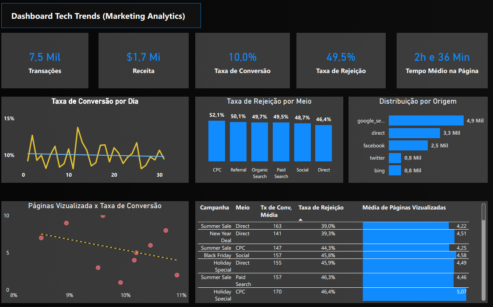

# Projeto: Dashboard Tech Trends - Análise de Marketing Digital

### ➡️ Análise Detalhada e Dashboard Interativo no Meu Portfólio:
[Acesse a página completa do projeto aqui](https://ferreiragabrielw.github.io/portfolio-gabriel/projetos/Dashboards/4CaseTechTrends/Projeto4DA.html)

---

## Sobre o Projeto

Este projeto apresenta um Dashboard de Marketing Analytics em **Power BI** para fornecer uma visão abrangente do desempenho das campanhas digitais e do comportamento do usuário. O objetivo é capacitar equipes de marketing a monitorar métricas chave como transações, receita, taxas de conversão e rejeição, e tempo médio na página, permitindo otimizar a alocação de recursos e refinar estratégias.

## Tecnologias e Processo

* **Ferramentas**: Power BI Desktop, Figma (prototipação e design), CSV (fontes de dados).
* **ETL**: Dados extraídos de `.csv`, transformados no Power Query (M) e modelados para análise consolidada.
* **Insights Chave**: Visão geral de performance (transações, receita, taxas de conversão/rejeição), tendência de conversão, qualidade do tráfego por canal (Direct com baixa rejeição), distribuição de tráfego por origem (Google, Facebook) e desempenho granular de campanhas específicas.

## Conteúdo do Repositório

* `dados/`: Bases de dados (CSV) utilizadas.
* `powerbi/`: Arquivo `.pbix` do dashboard Power BI.
* `quarto/`: Arquivo .qmd e sua versão HTML renderizada.
* `figma/`: Arquivos relacionados ao protótipo e design no Figma.
* `README.md`: Este documento.
* `LICENSE`: Licença do projeto (MIT License).

## Como Visualizar

* **Online**: [Acesse o dashboard publicado no Power BI Service](https://app.powerbi.com/groups/me/reports/f01d9373-7129-45a1-b703-90d551b8f262/ReportSection?experience=power-bi)
* **Localmente**: Faça o download do arquivo `.pbix` na pasta `powerbi/` e abra-o com o Power BI Desktop.

---

### Licença

Este projeto está licenciado sob a [MIT License](LICENSE).
